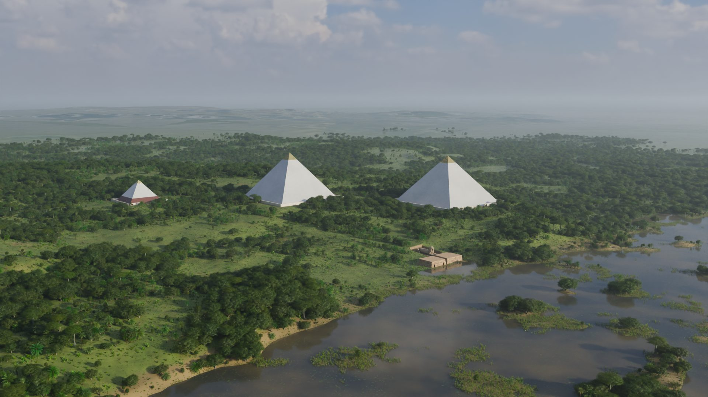

# Seked

**Version 1.0 · live at https://seked.pages.dev**

[Walk the plateau](https://seked.pages.dev/walk/) · [Films](https://seked.pages.dev/films/) · [Sky alignments](https://seked.pages.dev/alignments/) · [Claims dossier](https://seked.pages.dev/docs/dossier.html) · [Realtime viewer](https://seked.pages.dev/viewer/)

The Giza plateau rebuilt from the survey, path traced in five eras from the
claimed First Time of 10,500 BCE to today, in which every "encoded
mathematics" claim (π and φ in the profile, the 1:43,200 Earth scale, the
Orion Correlation, the shaft alignments and the rest) is computed from the
same measurements that build the geometry.

*Seked* is the Egyptian unit of slope: palms of run per cubit of rise. A
seked of 5½ is the whole π-and-φ story.



## What is in 1.0

| | |
|---|---|
| **The walkthrough** (`/walk/`) | Seventeen 360-degree stations, outdoors and inside the Great Pyramid and Khafre's valley temple, each in every era it stands in, path traced in Blender Cycles at 4096 by 2048. |
| **Five eras** | The First Time (c. 10,500 BCE, claim), the long rains (c. 7000 BCE, claim), Khufu's Giza (c. 2560 BCE, reconstruction), stripped and buried (c. 1800 CE, reconstruction), today (2026, survey). |
| **The films** (`/films/`) | The rollback from today to the First Time, the Sphinx's sequence from lion to excavation, and a flight up the approach as built. |
| **The sky alignments** (`/alignments/`) | Orion over the pyramids, the lion facing Leo, the shafts and their stars, each drawn as its strongest case with the size of its miss stated. |
| **The claims dossier** (`/docs/dossier.html`) | Twenty-two claims, each with its residual, tolerance and the free choices it needs; fifteen land within their own tolerance. |
| **The realtime viewer** (`/viewer/`) | The first, browser-rendered model, with live claim overlays, source presets, a section cut and a sky at any epoch. |

## The rules that keep it honest

1. **Nothing is typed twice.** Every number lives once in `data/measurements/` with a source in `data/sources.json`; derived quantities are computed, never stored.
2. **Claims are data.** One YAML file per claim in `data/claims/`: inputs, formulas, targets, tolerance, free choices, sources, overlay.
3. **Presets are preference orders over sources.** Switch from Petrie 1883 to Dash 2015 and every result recomputes.
4. **The sky is computed.** HYG 4.2 stars, Vondrák 2011 precession pinned in tests to ERFA.
5. **Pyramids from the survey; everything else placed, then labelled.** Temples, tombs and the Sphinx stand on surveyed footprints to about a metre and are marked as visual stand-ins.
6. **Every era says what it is**: survey, reconstruction, or claim drawn so it can be tested.

`CLAUDE.md` carries the full set, and `docs/plan.html` the original plan.

## Running it

```
pnpm install
pnpm test           # vitest, every package, the scripts and the Blender reader (1,014 tests)
pnpm typecheck      # the packages, the scripts and the viewer
python -m unittest discover -s render/tests   # the path tracer's bpy-free parts
pnpm dossier        # regenerate docs/dossier.md from data/
pnpm shafts         # solve the shaft alignment epochs into docs/shafts.md
pnpm dev:web        # the realtime viewer on a Vite dev server
pnpm site           # assemble site/: landing page, walkthrough, films, alignments, viewer, progress, docs
pnpm run deploy     # assemble and upload to Cloudflare Pages (https://seked.pages.dev)
```

The path-traced scenes are built and rendered headless in Blender 5.1
(`C:\Program Files\Blender Foundation\Blender 5.1\blender.exe`, not on PATH):

```
blender -b --factory-startup -P render/build.py -- --state built --shot panorama
blender -b --factory-startup -P render/build.py -- --queue render/queues/eras-v7.json
python render/publish.py          # build/render/pano/ -> apps/walk/pano/ and stations.json
python render/film.py rollback    # and `sphinx`: films cut from the hero stills
```

A full era queue takes about two hours on an RTX 5070 Ti laptop; long jobs
run detached through `python scripts/job.py start` (see `CLAUDE.md`, "One
session at a time"). The panoramas and films are build outputs and are not
committed; `pnpm site` assembles whatever is present and says what it left
out.

## Layout

```
data/            measurements, sources, presets, claims, stars, terrain, footprints, the city
packages/        units, geometry, data (loader, presets), claims (parser, evaluator, dossier), sky, runner
render/          the path tracer: render/giza/ builds each era in Blender; stations, shots, queues, films, publish
apps/home/       the landing page
apps/walk/       the walkthrough (panoramas published into pano/)
apps/films/      the films page
apps/alignments/ the sky alignments page
apps/web/        the realtime viewer (Vite, React Three Fiber)
blender/         the original scene generator and its stdlib data reader
scripts/         dossier, shafts, star, footprint and city imports, sky bakes, site assembly, the job runner
docs/            plan, dossier, shafts, progress snapshots, history, design specs
```

## Where it stops

1.0 is a stopping point, not an ending. Left open:

- **The First Time's lion and its figures** are the weakest frames; they wait on new Meshy generations.
- **Unverified records**: entries from the starting sheet that nobody has yet checked against the cited page stay `verified: false`, and `qc.shaft.north.angle` (claim C2) cannot be verified from Gantenbrink's report at all.
- **Geometry holes** listed in `docs/geometry-blockers.md`: Khafre's casing cap, Menkaure's chambers, the mastaba field as surveyed rather than plausible.
- **Next ideas**: a guided tour of the star alignments inside the walkthrough, and an LLM that runs a claim in somebody's own words against the model (`pnpm claim` is the start of it).

How the model got here, stage by stage, is in [`docs/history.md`](docs/history.md)
and the milestone renders in [`docs/progress/`](docs/progress/README.md).

## Credits and data licences

Star catalogue HYG 4.2 (CC BY-SA 4.0, David Nash). Monument footprints © OpenStreetMap contributors (ODbL). City footprints and heights from Google Open Buildings v3 and 2.5D Temporal (CC BY 4.0). Terrain from Copernicus GLO-30. Skies and textures from Poly Haven (CC0). Stand-in models as listed with their licences in `blender/models.json`. Surveys and claims as cited in `data/sources.json`.
