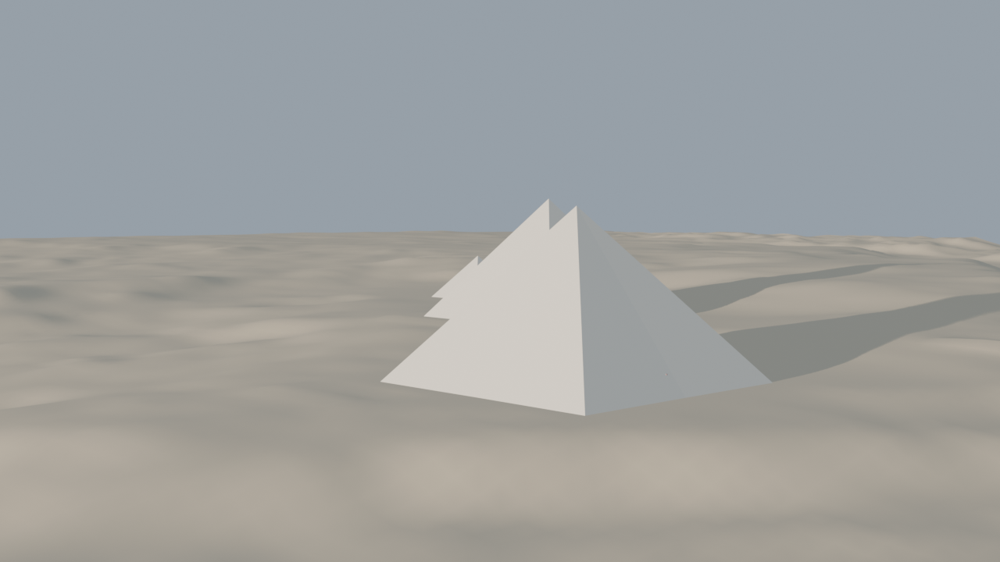
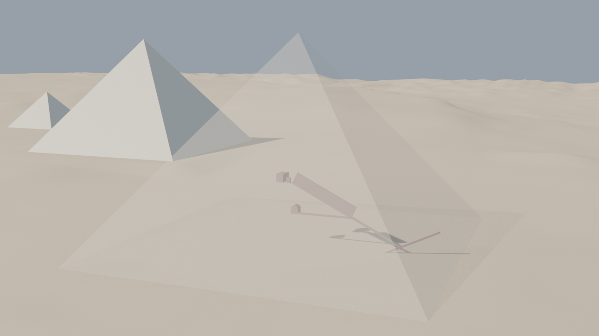
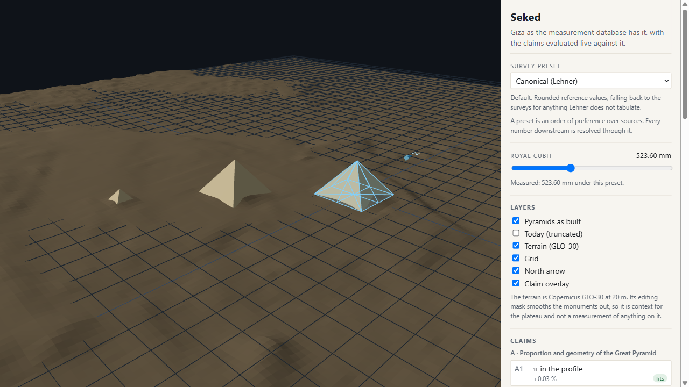
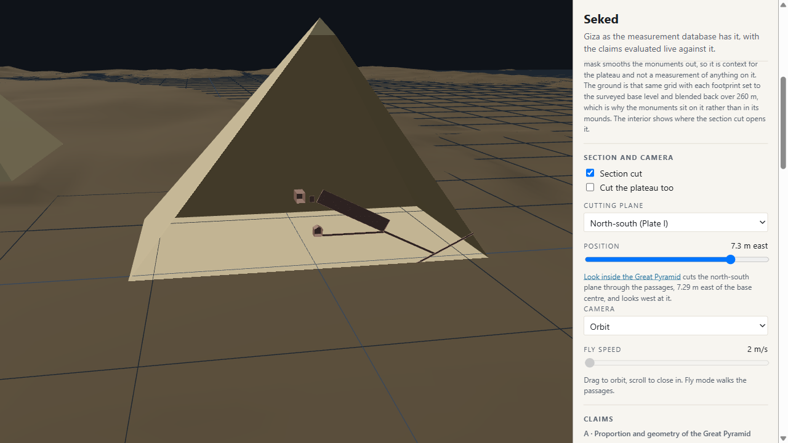
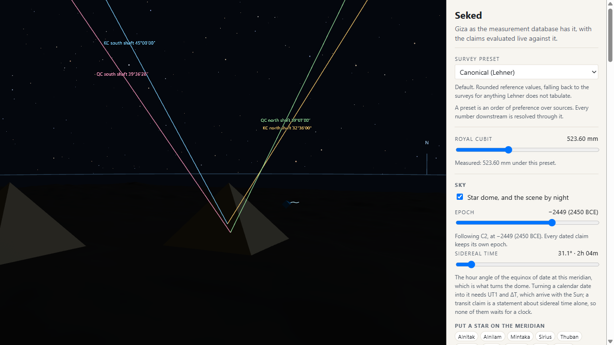
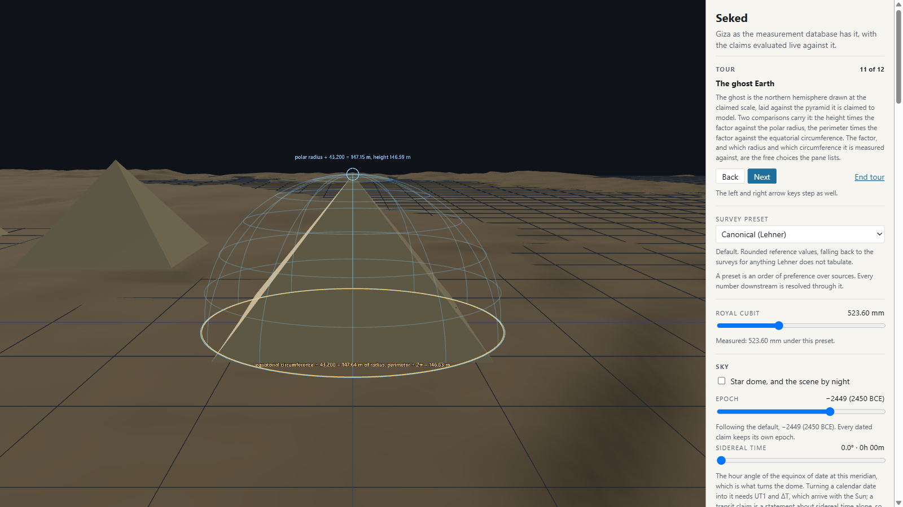
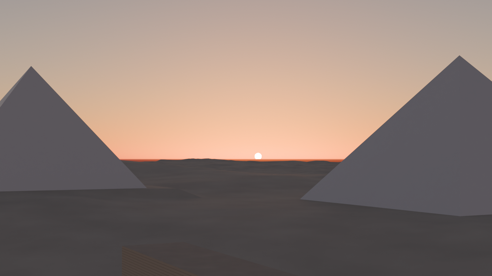
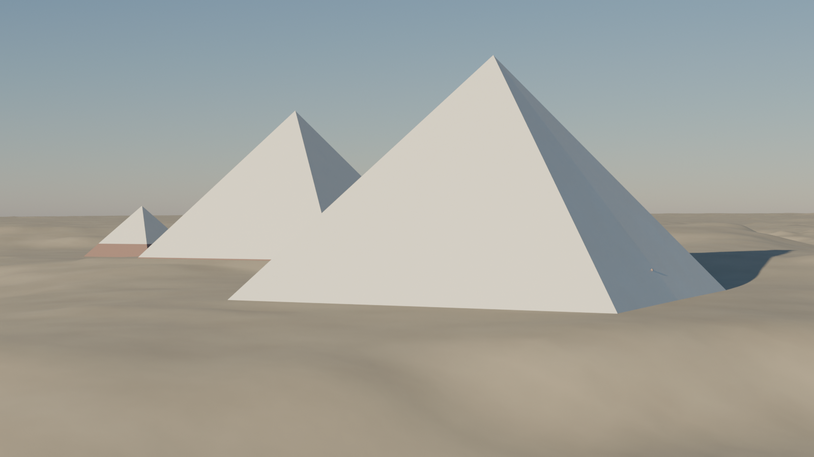
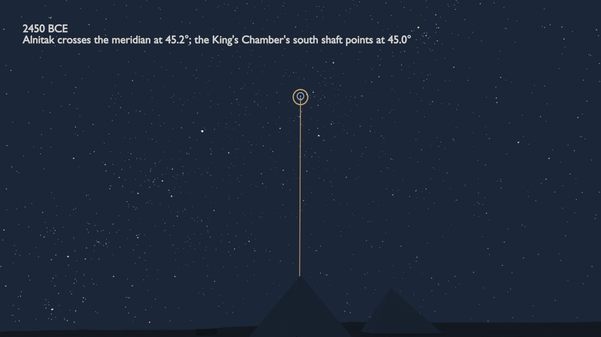

# Progress snapshots

Renders and screenshots taken at milestones, oldest first, so the project's
path from the first low-poly plateau to the finished viewer can be shown on
the project page. Each one names the commit it was taken at.

| # | Image | Taken | What it shows |
|---|---|---|---|
| 0001 |  | 2026-09-13 | First headless render: the three pyramids generated from the database, placed by Petrie's centre offsets on the GLO-30 ground, equinox dawn from the east. Eight-sided G1 with its concavity shape key; no interiors visible, no casing detail, no Sphinx, terrain at 20 m. |
| 0002 |  | 2026-09-13 | The Great Pyramid's casing made translucent from the east: the descending passage, subterranean chamber, ascending passage, Queen's Chamber with its gable, Grand Gallery, Antechamber and King's Chamber, all built from Petrie's 1883 positions (section 64 and the chapter 7 sections). Gallery corbels are placeholders; the subterranean passages use the entrance passage's section. |
| 0003 |  | 2026-09-13 | The web viewer's first screenshot: the same pyramids built in the browser by the geometry package, the GLO-30 context terrain, the A1 ghost-profile overlay on the Great Pyramid, and the panel with the survey preset, the live cubit slider, layer toggles and the graded claims list. No interiors, sky or section cuts yet. |
| 0004 |  | 2026-09-14 | The viewer's section cut: the north-south plane through the passages, 7.29 m east of the base centre, opened by the look-inside action. Interiors now build in the browser from the same records as Blender, on the ground flattened to the surveyed base levels; fly camera available. Khafre and Menkaure carry Petrie's dimensions but no positions yet, so their interiors stay empty. |
| 0005 |  | 2026-09-14 | The sky layer: the HYG catalogue precessed to 2450 BCE with Alnitak on the meridian, the horizon ring, and claim C2's four shaft rays climbing from the King's and Queen's Chambers to the dome, each labelled with its measured angle. The epoch slider now drives the sky claims live. |
| 0006 |  | 2026-09-14 | Phase 4 closed: every overlay a claim declares now draws. Seen here from the tour's eleventh step, claim B1's ghost Earth: the northern hemisphere at one part in 43,200 laid on the Great Pyramid's base centre, with the scaled polar radius against the height (147.15 m against 146.59 m) and the scaled equator against the perimeter's own circle. The same session added the King's Chamber wireframe, the casing and socket outlines, Legon's rectangle, the Heliopolis line, the three parallels of B3 with the Egypt 1907 datum shift, claims C7, D3 and D4, the tour, and a calendar for the Sun. |
| 0007 |  | 2026-09-14 | The first render lit from the sky package rather than by hand: Cycles, a physical (Nishita) sky and a sun lamp placed from a baked azimuth and altitude, materials for casing, core, granite and sand. Seen from the Sphinx's viewpoint, the summer solstice sun of 2500 BCE sets into the notch between the Great Pyramid and Khafre's at the azimuth claim C6 computes, which is Lehner's akhet. The same pass produced an equinox dawn, a cutaway and a night dome with Alnitak on the meridian. Still placeholders: the Sphinx box, the mean course height on the core, the horizon beyond the 6 km grid. |
| 0008 |  | 2026-09-14 | The plateau under the equinox dawn again, now with its horizon: a coarse ring of the same GLO-30 heightfield carries the ground out to 12 km, so the dark band where the 6 km grid stopped is gone and the desert meets the sky. Menkaure's lowest sixteen courses are granite and the foot of Khafre's is one course of it, both from Petrie (§82 and §68), switched on each object's own height above its base. The render script is now three modules and the sun lamp no longer counts its own dimming twice. Still placeholders: the Sphinx box and the mean-course bands on it. |
| 0009 |  | 2026-09-14 | A frame of the plan's sky-rollback cinematic, [the whole film beside it](0009-blender-rollback.mp4) (480 frames, 20 s, 4 MB): every bright star's place at every frame baked from the sky package, the epoch run from 2000 CE back to 10,500 BCE with Alnitak held on the meridian. The orange line is the King's Chamber's south shaft as a line of sight at its measured 45°, the orange ring where a star aligned with it would stand, the blue ring Alnitak itself; at 2450 BCE, the epoch claim C2 names, the one sits in the other, and by 10,500 BCE the star transits just above the apex. No sun is in the film, the pyramids are the silhouettes a moonless night makes of them, and nothing in the Blender script computes or types a star position. |
