# Progress snapshots

Renders and screenshots taken at milestones, oldest first, so the project's
path from the first low-poly plateau to the finished viewer can be shown on
the project page. Each one names the commit it was taken at.

These are the frames that were chosen. Every render made along the way, kept
or not, is in [`log/`](log/README.md), named so the folder sorts by when it
was taken and stamped with its date, its view and its commit.

| # | Image | Taken | What it shows |
|---|---|---|---|
| 0001 |  | 2026-09-13 | First headless render: the three pyramids generated from the database, placed by Petrie's centre offsets on the GLO-30 ground, equinox dawn from the east. Eight-sided G1 with its concavity shape key; no interiors visible, no casing detail, no Sphinx, terrain at 20 m. |
| 0002 |  | 2026-09-13 | The Great Pyramid's casing made translucent from the east: the descending passage, subterranean chamber, ascending passage, Queen's Chamber with its gable, Grand Gallery, Antechamber and King's Chamber, all built from Petrie's 1883 positions (section 64 and the chapter 7 sections). Gallery corbels are placeholders; the subterranean passages use the entrance passage's section. |
| 0003 |  | 2026-09-13 | The web viewer's first screenshot: the same pyramids built in the browser by the geometry package, the GLO-30 context terrain, the A1 ghost-profile overlay on the Great Pyramid, and the panel with the survey preset, the live cubit slider, layer toggles and the graded claims list. No interiors, sky or section cuts yet. |
| 0004 |  | 2026-09-14 | The viewer's section cut: the north-south plane through the passages, 7.29 m east of the base centre, opened by the look-inside action. Interiors now build in the browser from the same records as Blender, on the ground flattened to the surveyed base levels; fly camera available. Khafre and Menkaure carry Petrie's dimensions but no positions yet, so their interiors stay empty. |
| 0005 |  | 2026-09-14 | The sky layer: the HYG catalogue precessed to 2450 BCE with Alnitak on the meridian, the horizon ring, and claim C2's four shaft rays climbing from the King's and Queen's Chambers to the dome, each labelled with its measured angle. The epoch slider now drives the sky claims live. |
| 0006 |  | 2026-09-14 | Phase 4 closed: every overlay a claim declares now draws. Seen here from the tour's eleventh step, claim B1's ghost Earth: the northern hemisphere at one part in 43,200 laid on the Great Pyramid's base centre, with the scaled polar radius against the height (147.15 m against 146.59 m) and the scaled equator against the perimeter's own circle. The same session added the King's Chamber wireframe, the casing and socket outlines, Legon's rectangle, the Heliopolis line, the three parallels of B3 with the Egypt 1907 datum shift, claims C7, D3 and D4, the tour, and a calendar for the Sun. |
| 0007 |  | 2026-09-14 | The first render lit from the sky package rather than by hand: Cycles, a physical (Nishita) sky and a sun lamp placed from a baked azimuth and altitude, materials for casing, core, granite and sand. Seen from the Sphinx's viewpoint, the summer solstice sun of 2500 BCE sets into the notch between the Great Pyramid and Khafre's at the azimuth claim C6 computes, which is Lehner's akhet. The same pass produced an equinox dawn, a cutaway and a night dome with Alnitak on the meridian. Still placeholders: the Sphinx box, the mean course height on the core, the horizon beyond the 6 km grid. |
| 0008 |  | 2026-09-14 | The plateau under the equinox dawn again, now with its horizon: a coarse ring of the same GLO-30 heightfield carries the ground out to 12 km, so the dark band where the 6 km grid stopped is gone and the desert meets the sky. Menkaure's lowest sixteen courses are granite and the foot of Khafre's is one course of it, both from Petrie (§82 and §68), switched on each object's own height above its base. The render script is now three modules and the sun lamp no longer counts its own dimming twice. Still placeholders: the Sphinx box and the mean-course bands on it. |
| 0009 |  | 2026-09-14 | A frame of the plan's sky-rollback cinematic, [the whole film beside it](0009-blender-rollback.mp4) (480 frames, 20 s, 4 MB): every bright star's place at every frame baked from the sky package, the epoch run from 2000 CE back to 10,500 BCE with Alnitak held on the meridian. The orange line is the King's Chamber's south shaft as a line of sight at its measured 45°, the orange ring where a star aligned with it would stand, the blue ring Alnitak itself; at 2450 BCE, the epoch claim C2 names, the one sits in the other, and by 10,500 BCE the star transits just above the apex. No sun is in the film, the pyramids are the silhouettes a moonless night makes of them, and nothing in the Blender script computes or types a star position. |
| 0010 | 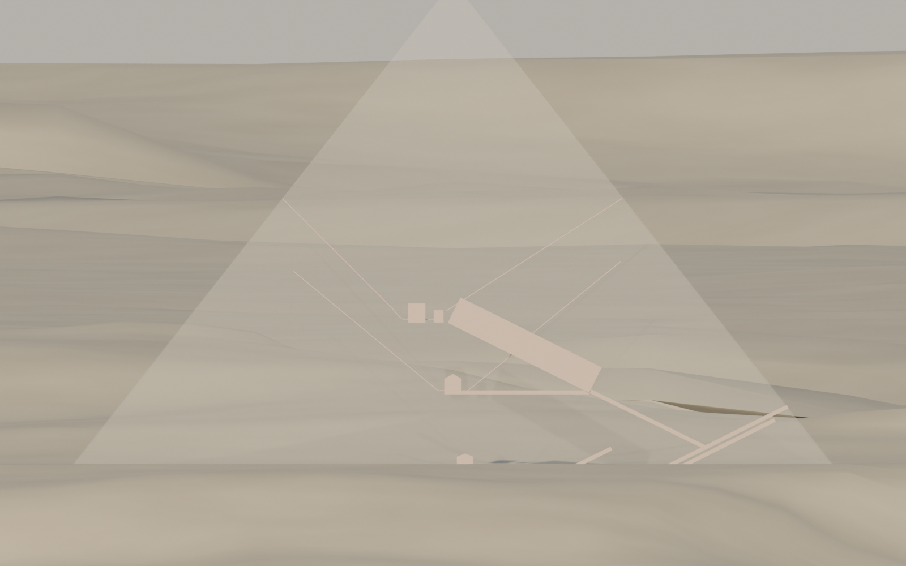 | 2026-09-15 | The Great Pyramid in elevation from due east through a casing left almost clear, an orthographic camera so nothing is foreshortened: the descending passage from the north face to the subterranean chamber, the ascending passage, the Queen's Chamber with its gable, the Grand Gallery, the Antechamber and the King's Chamber, all from Petrie's positions, and for the first time the four shafts as bores. Gantenbrink's inlet runs and angles, the northern shafts' dog-legs round the Gallery, the slab 59 m up the Queen's Chamber's southern shaft, and Petrie's mouths on the faces; the few figures only his drawings give are labelled estimates. The pale interior against sand is the render's weakness, not the data's. |
| 0011 | 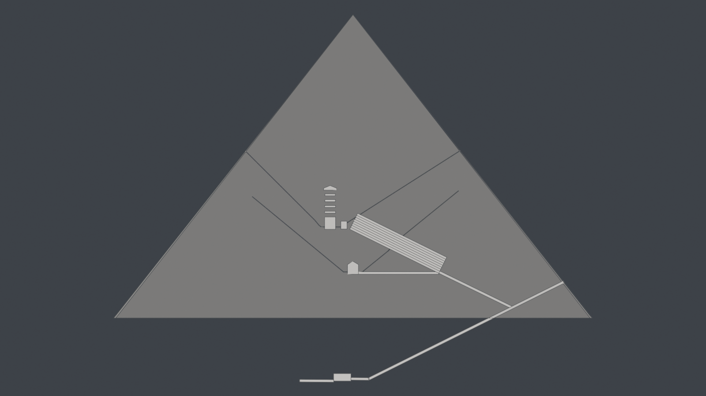 | 2026-09-16 | The same section, now a drawing and no longer a photograph of one, with the five chambers of construction standing over the King's Chamber for the first time. Petrie §62 measures their walls apart and Vyse's appendix tabulates their heights, but nobody measured the granite beams they are floored with, so the stack is solved against the one figure that closes it: 69 ft 3 in from the King's Chamber floor to the roof of Campbell's, which leaves 1.85 m a beam. The render itself changed with them. There is no sun inside a pyramid, so nothing here is lit: the masonry, the void and the ground each carry a value of their own, the casing is a fifth opaque, and Freestyle draws a hairline on every edge that stands behind the casing and nothing further, which is what keeps the Grand Gallery's corbels from coming back twice and hatching it. The terrain, the sky, the sun and the other two pyramids are out of the frame, because a section of one pyramid is a picture of that pyramid. |
| 0012 | 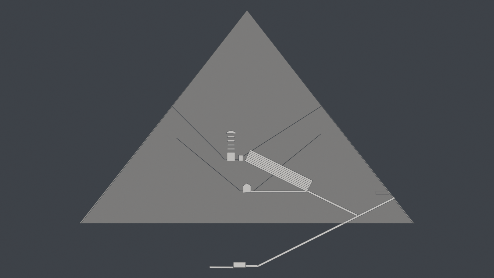 | 2026-09-16 | The first solid in the scene that nobody has stood in: the ScanPyramids North Face Corridor, 9.06 by 2.02 by 2.18 m, drawn as an open outline high on the right, just inside the north face and above the descending passage. Procureur and the others fitted it to a muon deficit to a few centimetres and the records carry their error bars; where it stands is derived and not stored, its east-west axis being the descending corridor's, which the paper states, and its north end standing 0.84 m behind the face at its own mid-height, the Chevron standing in that face. It has no fill because a shape fitted to a muon deficit should not read like a room with a floor, and that is the evidence tier showing up in the drawing rather than in a footnote. The Big Void is not here yet: the 2017 paper gives it a length and a cross-section but the position needs the figure, not the abstract. |
| 0013 |  | 2026-09-16 | The ScanPyramids Big Void, over the Grand Gallery, drawn as the two crossed boxes it honestly is. Morishima and the others' 2017 paper puts no coordinate for it anywhere in its text: it says the void is above the Grand Gallery, that its cross section is comparable to the Gallery's, that it is at least 30 m long, and that its centre lies between 40 m and 50 m from the floor of the Queen's Chamber. Those four close it. "Above the Grand Gallery" fixes two coordinates, the Gallery's own plan midpoint and its east offset, and the distance fixes the third, which comes out at 61.5 m over the pavement, ten metres over the Gallery's roof, the two bounds putting it between 56 and 67. The paper also says the void "could be inclined or horizontal" and leaves it there, so both are drawn on that one centre and neither is preferred. Nothing here was read off a figure. |
| 0014 | 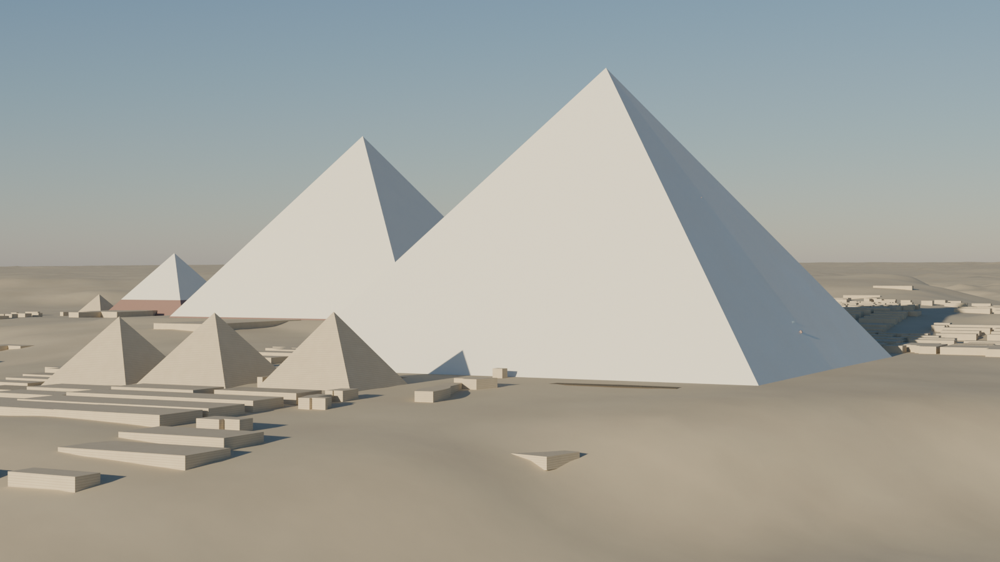 | 2026-09-16 | The same dawn as 0008, and for the first time the plateau is more than three pyramids and sand. The three queens' pyramids stand before Khufu, the Eastern Cemetery's mastabas run in their long streets, the Western Field sits up the slope behind on the right, a boat pit is a dark slot at Khufu's foot and Menkaure's queens are in the distance: 22 monuments and 577 mastabas from OpenStreetMap, fitted onto Petrie's three pyramids with residuals under a metre and an unfitted scale of 0.99962, and set on the scene's own ground. The Sphinx is out of frame here and is now OSM's three-dimensional model of it, standing in its hollow forty metres below Khufu's base where the old box floated on the datum plane. The masses are massings: outlines carried up to heights that are OSM's or an estimate. |
| 0015 | 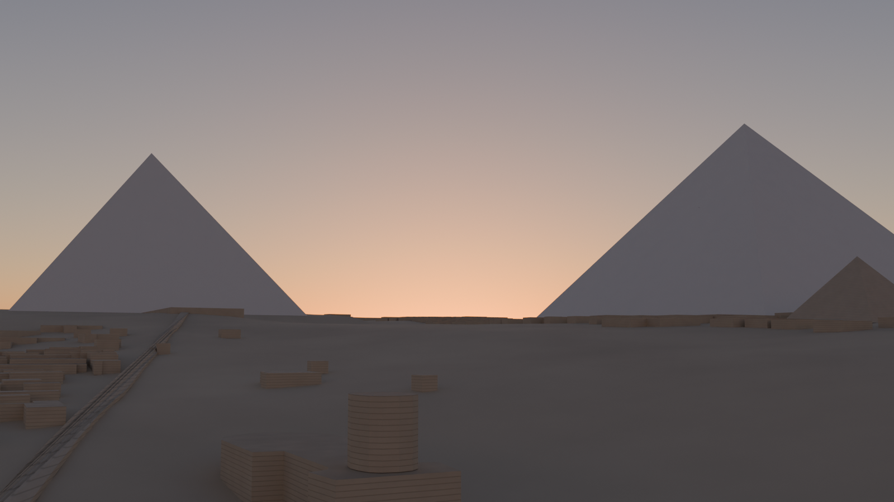 | 2026-09-16 | The akhet again, recomposed around the Sphinx OSM models, which stands in its hollow where the old box floated forty metres above it: its head and body in the foreground, the summer solstice sun of 2500 BCE in the notch. New in the frame is Khafre's causeway, climbing from the valley temple on the left up its ridge to his mortuary temple at the pyramid's foot, at the "about 15 feet wide" Petrie gives it and 495 m long, his "over quarter of a mile". Its first version was a straight ramp between the two temple floors and ran up to three and a half metres underground, so it is laid on the terrain in 24 segments. Out of frame, Khufu's basalt temple floor is built from the four corners Petrie measured in section 28. |
| 0016 | 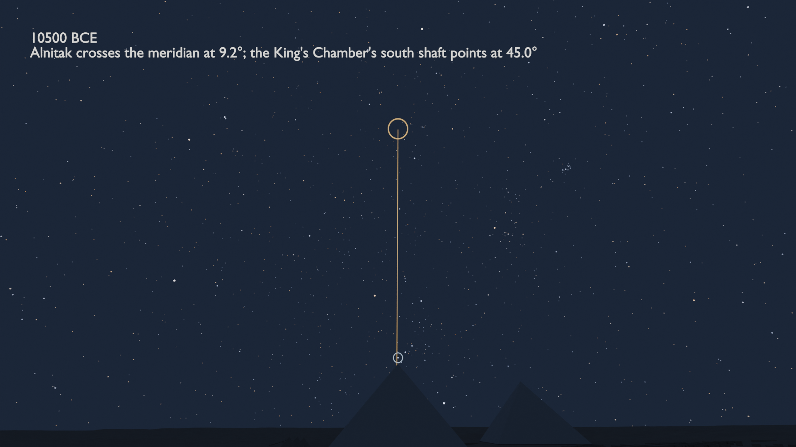 | 2026-09-16 | The sky-rollback film again, [now at hero quality](0016-blender-rollback-hero.mp4) (480 frames at 1920 by 1080, 128 samples, 20 s, 8 MB), over the populated plateau and with every star still baked from the sky package. This is its last frame: 10,500 BCE, Alnitak transiting at 9.2 degrees, just above the apex, while the King's Chamber's south shaft still points at 45. It is the first render in the project done on the GPU. Every earlier one ran on the CPU because Cycles uses a GPU only when told to, and with the plateau's six hundred masses a 1080p frame had grown to a minute; on the RTX 5070 Ti the film took 170 minutes instead of about nine hours. The muon voids are hidden in it, after the North Face Corridor's faint glow showed through the north face as a point of light on the first test frame. [Its 2450 BCE frame](0016-blender-rollback-hero-2450-bce.png) is the epoch claim C2 names: Alnitak crosses the meridian at 45.2° and the shaft points at 45.0°, the blue ring inside the orange. The film was rendered before the materials, the air and the Milky Way of 0018 to 0020, and has none of them. |
| 0017 | 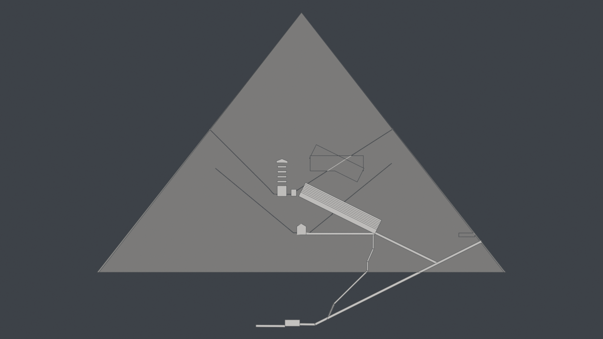 | 2026-09-16 | The section with the well shaft in it for the first time, dropping from the foot of the Grand Gallery to the descending passage near its lower end: vertical, steep, vertical again through the grotto, a long run at 45° and a last steep leg. Smyth measures only its mouth, so the legs are Maragioglio and Rinaldi's, printed on their Parte IV plates, and the two slopes they do not print are scaled off the plates with `scripts/plate.py` and a stated sigma. The last leg is solved onto the opening 7.62 m up the passage and misses their own 9.50 m at 75° by 1.3 m in the section, inside what the scaled angles allow. |
| 0018 | 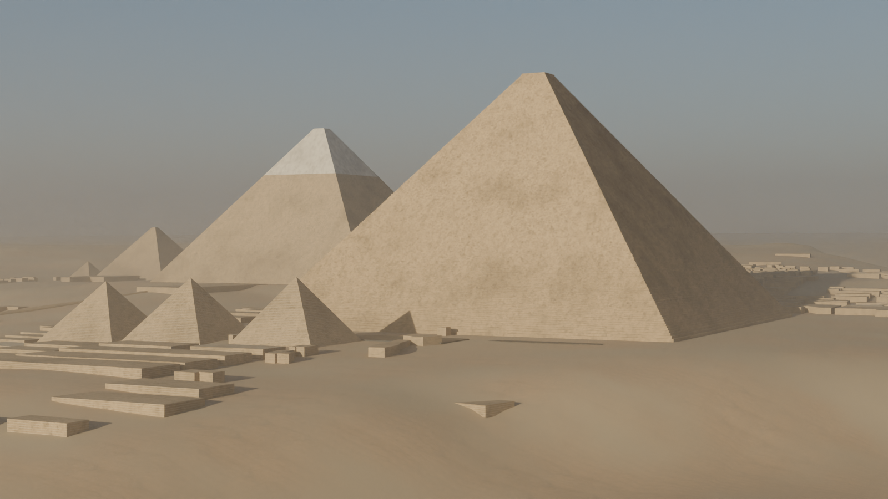 | 2026-09-16 | The equinox dawn of 0014, now of the pyramids as they stand (`--state today`) and no longer flat colour. The stone is four CC0 photographed texture sets from Poly Haven, projected at two scales against repeats, with block-to-block tone and weathering; Khafre wears his cap of casing from 93.9 m up, Perring's present height less the 40 to 45 m Maragioglio and Rinaldi give it; and haze and a low dust layer put air between the camera and Menkaure, kept out of the shadow rays so the sun is not dimmed twice. The air's densities and the tints are look choices, and say so. |
| 0019 | 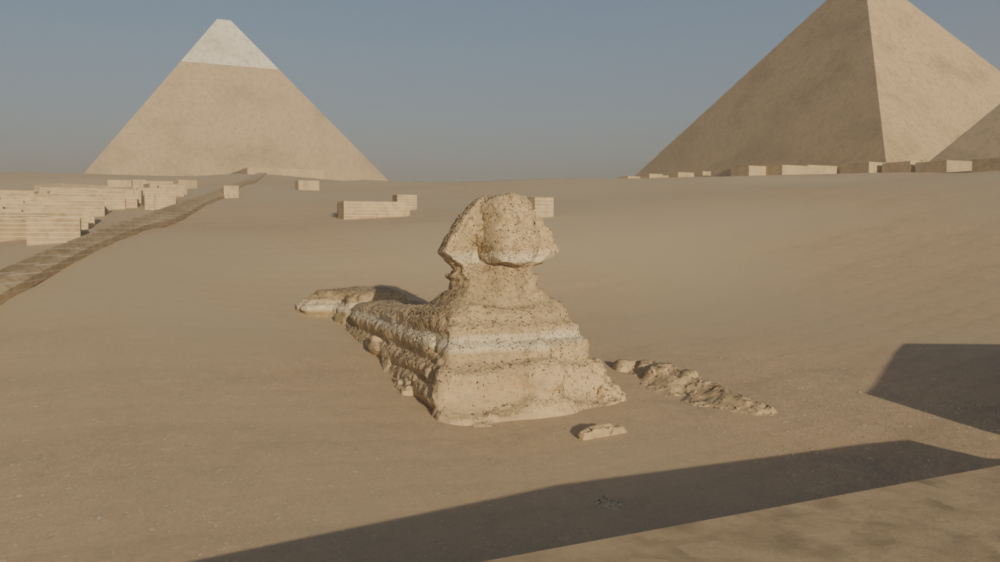 | 2026-09-16 | The first stand-in model: the Watt Institution's CC BY scan of Bert Longworth's 1903 bronze of the Sphinx, fetched through the Sketchfab API, cut from its plinth and fitted at render time to the OSM outlines it replaces by their principal axis and length (75 m, turned to face east). It is a sculptor's model of the Sphinx as it stood in 1903, sand to its chest, so its paws are buried and it stands 16.5 m against 20; the manifest says so and a scan of the excavated Sphinx should replace it. Khafre's cap stands behind it, Khufu's stepped core to the right. |
| 0020 | 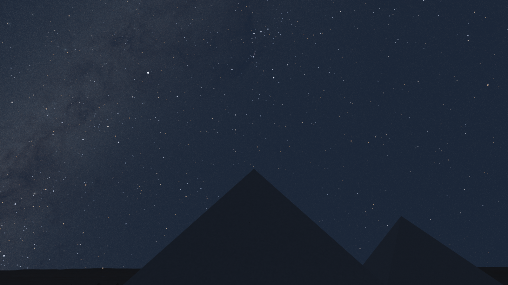 | 2026-09-16 | The night of 2449 BCE with Alnitak on the meridian, now with the Milky Way behind the 8,920 HYG stars: NASA's Deep Star Maps 2020 background, turned into the local sky by the transpose of the rotation the sky bake exports, which is the stars' own precession and horizon turn. Checked by swapping in NASA's constellation figures for one render, whose vertices land on the stars except where 4,450 years of proper motion have moved them. |
| 0021 | 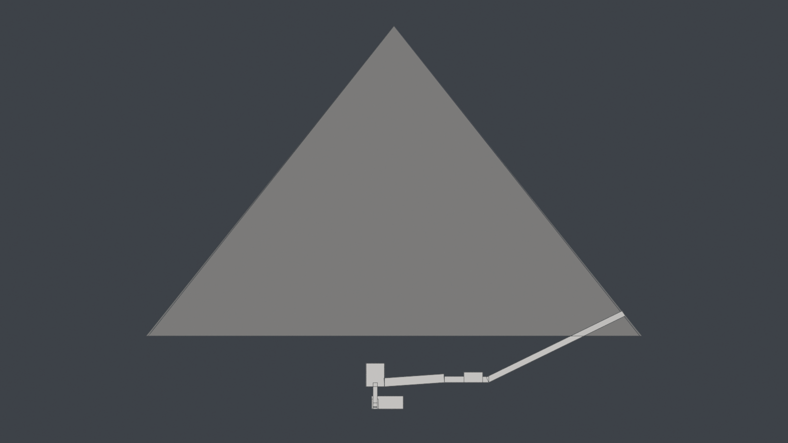 | 2026-09-16 | Menkaure's pyramid in section, and for the first time the rooms under it: the corridor down from the north face, the short level stretch, the panelled antechamber, the room of the portcullises, the corridor falling at 4° and the large chamber. No plan gives their places in words, so they are walked: Perring's chain of distances and Maragioglio and Rinaldi's description laid end to end from the entrance, each chamber entered through the door Petrie measured. The large chamber's floor comes out at -10.59 m, and Tav. 4 of Maragioglio and Rinaldi's plates prints Perring's level for it as 10.55 m below the base, which is the check. The same increment found that Khafre's and Menkaure's interiors had always been built at the origin, inside the Great Pyramid, and put them under their own pyramids. The route then carries on down to the granite crypt that held his basalt sarcophagus, the one lost at sea in 1838: west out of the middle of the large chamber's floor at a slope that no source prints and is scaled off Tav. 6 at 27.5 ± 1.8°, past the portcullis slot, along the horizontal passage and in through the crypt's east wall, whose doorway Petrie puts flush with its south wall. The crypt's floor comes out at -15.27 m against the 15.55 m Tav. 4 prints, 28 cm high, inside what the scaled slope allows. The chamber of the niches, off the horizontal passage, is still to route. |
| 0022 | 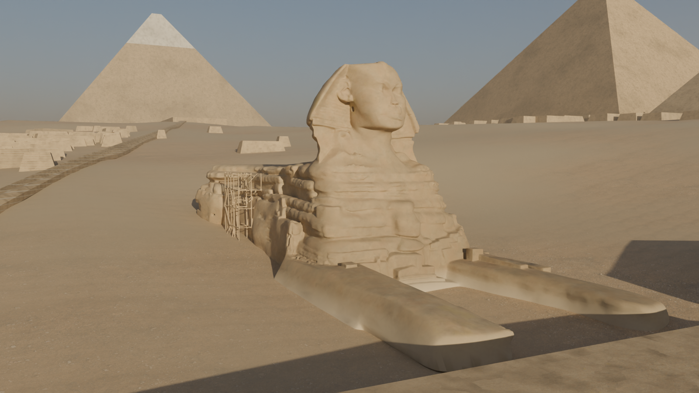 | 2026-09-16 | The Sphinx as it stands now, paws and all, replacing 0019's bronze of 1903 that was buried to the chest. No downloadable scan of the excavated Sphinx exists, so this one is generated: Meshy's multi-image model built it from four CC0 photographs on Wikimedia Commons, a front three-quarter, the south side, the rump and the south-east corner, for 35 credits. It came back as one piece with the scaffolding that stands against the chest in three of the photographs, which is left on, and with a boxier rump than the real one. It is fitted like any stand-in to the OSM outlines, 75 m long and facing east, but turned by its own front rather than its principal axis, which the scaffolding pulled six degrees askew. Fitted by length it stands 24.3 m against OSM's 21.1 m, which is the generated proportion showing, and is said so in the manifest. A second try from photographs without scaffolding fused the figure to the enclosure floor and lost a paw, and was not used. The sand still runs up to its flanks: the scene has no cut enclosure yet. |
| 0023 | 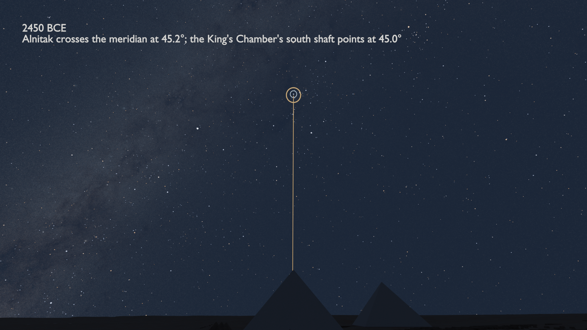 | 2026-09-16 | The sky-rollback film of 0016 rendered again, [the whole film](0023-blender-rollback-hero-milky-way.mp4) (480 frames at 1920 by 1080, 128 samples, 20 s, 12 MB), now with the Milky Way of 0020 turning frame by frame with the stars, since each frame's `icrsToEnu` comes from the same bake as its star positions. This frame is 2450 BCE, where Alnitak crosses the meridian at 45.2° and the King's Chamber's south shaft points at 45.0°, the blue ring inside the orange; [the last frame](0023-blender-rollback-hero-milky-way-10500-bce.png) is 10,500 BCE, Alnitak at 9.2° just over the apex. The film took 230.6 minutes on the GPU, an hour more than 0016 (it shared the GPU with other renders for part of the evening), and the scene is the one committed at 05d2054, so the pyramids carry the stone of 0018 though at night it hardly shows. 0016 is kept as it was. |
| 0024 | 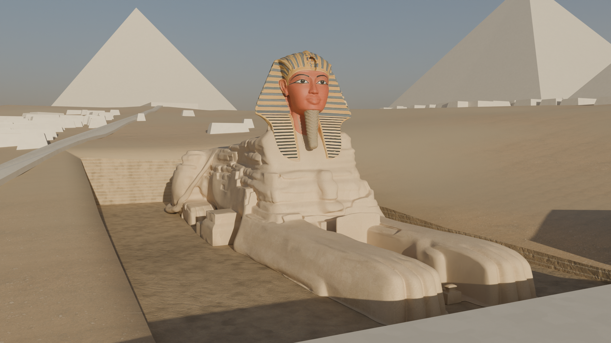 | 2026-09-16 | The Sphinx three ways, from the same camera in front of its paws. As it was carved, above, with the pyramids as built behind it: its nose, the uraeus on its brow, the plaited beard and the nemes painted in ochre and blue, standing in its enclosure, which is now cut out of the ground with walls in the bedrock's beds. [As a lion](0024-blender-sphinx-lion.png), the claim that it was first carved with a lion's head, switched on with `--sphinx lion` and never shown by default. [As it stands](0024-blender-sphinx-today.png), under today's pyramids. None of the three is a scan: Meshy's image model restored four photographs of the Sphinx one at a time, keeping each photograph's camera and the body's proportions and changing only the head and the finish, and its multi-image model built the mesh from the four; a first try from a text prompt alone came back a cartoon cat, and one from all the photographs at once a statuette. Each is fitted to the OSM outline by its own front, 75 m long; the carved one stands 25.3 m and the lion 28.2 m against OSM's 21.1 m, which is the generated heads showing. The casing on the pyramids behind is new too: polished Tura limestone with its joints laid on the Great Pyramid's 201 surveyed courses and a capstone after Amenemhat III's. |
| 0025 | 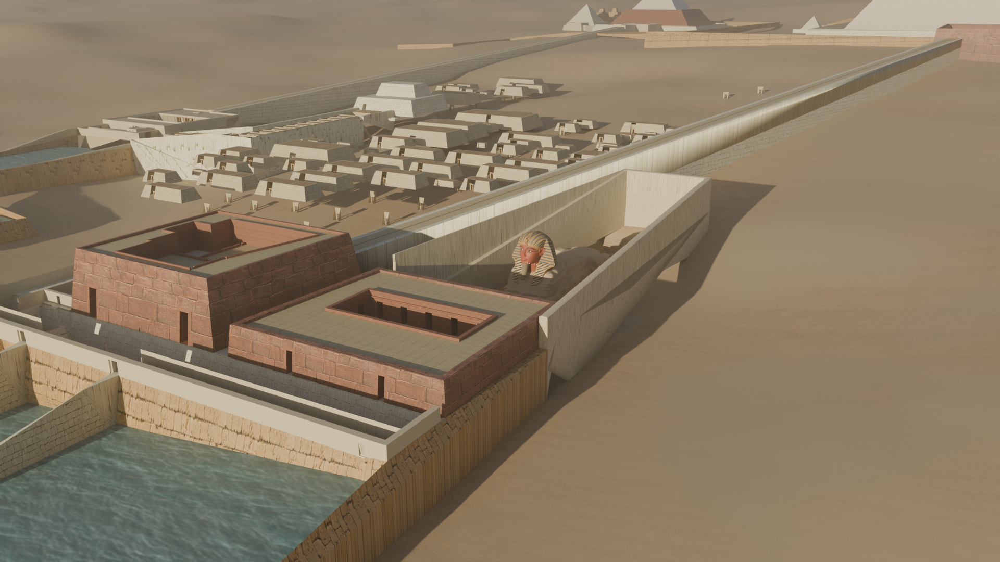 | 2026-09-16 | The plateau as it was built, from the air north-east of the Sphinx: the harbour basin at the foot of the plateau, Khafre's granite valley temple and the Sphinx Temple on its quay, the covered causeway climbing west to Khafre, the mastaba streets of the Eastern Field, and the Sphinx as carved in its walled enclosure. Everything but the pyramids, the Sphinx and the ground is L.VII.C's reconstruction of the whole plateau (via gwenajello on Sketchfab), placed at render time by `blender/render_reconstruction.py`: a least-squares similarity through the centres of its three pyramids lands it at 14.444 m a model unit and 90.80 degrees, with residuals of 2.1, 4.3 and 2.2 m, its own pyramids, ground and Sphinx are dropped for the database's, and each part is moved from its ground onto this scene's, the low spread-out ones vertex by vertex. Its forms are the reconstructor's, not measurements. |
| 0026 | 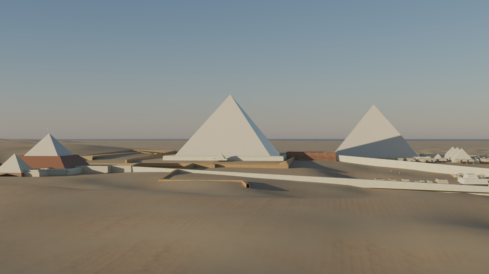 | 2026-09-16 | A new view for the two states: the three pyramids from the desert to the south under the December sun an hour before it sets, a moment added to the sky bake so the south faces take the light and the east faces fall into shadow. Above, as built, with the reconstruction's temples, causeways and enclosure walls; [the same view today](0026-blender-panorama-today.png), with Khafre's cap of casing catching the sun; and [the equinox dawn of 0018 as built](0026-blender-dawn-as-built.png), Khufu within his enclosure wall and his causeway running out past the queens' pyramids. Getting here took a look at why the renders read flat: from the south-west every visible face was sunlit, and over 1.7 km the haze whitened what contrast there was, so a view may now thin the air and set a grade. |
| 0027 | 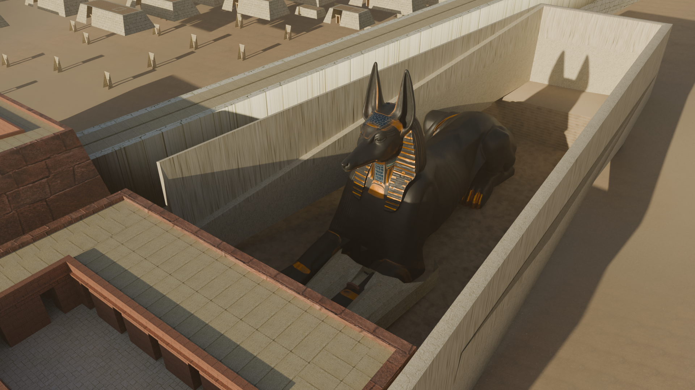 | 2026-09-17 | The ancient state, the plateau as built with the claims about its age shown in place of the mainstream reading: the Sphinx as a recumbent Anubis, Robert Temple's reading that the monument was first a jackal whose head was later recut. It is painted matt black all over, the colour of Anubis in Egyptian painting, with gold leaf and lapis on the lappets and collar, a finish Stewart chose from five Meshy retextures of the same generated mesh. The retexture paints gold as a flat orange and marks it barely metallic, so the render finds the gold by its colour and makes it metal, which is why the lappets catch the sun. [From in front of the paws](0027-blender-ancient-anubis-front.png) and [over the valley temples and the harbour](0027-blender-ancient-harbour.png). Nothing of the statue's form or paint is evidence: it is generated from photographs of today's Sphinx, fitted to its outline, and at 35.7 m to the ear tips it stands well over OSM's 21.1 m for the head. |
